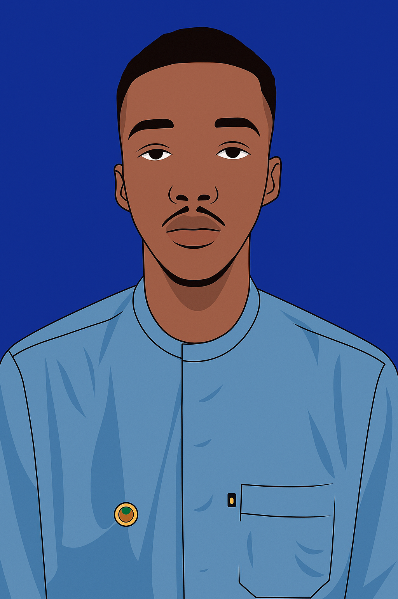

# Fofana Sita Portfolio Website

## Project Overview
This is a personal portfolio website for Fofana Sita, a web developer. The website showcases skills, projects, and contact information in a modern, responsive design with interactive elements.

## Features
- **Responsive Design**: Adapts to different screen sizes with a mobile-friendly navigation.
- **Interactive Navigation**: Smooth scrolling and section toggling.
- **Hero Section**: Animated background with particles and typing effect.
- **About Section**: Profile image and description.
- **Skills Section**: Progress bars for various skills.
- **Projects Section**: Dynamic project cards rendered with React.
- **Contact Section**: Contact form with validation and social links.
- **Animations**: Scroll reveal, particle background, and hover effects.

## Technologies Used
- **HTML5**: Structure of the website.
- **CSS3**: Styling, animations, and responsive design.
- **JavaScript**: Interactivity, form handling, and animations.
- **React**: For rendering the projects section dynamically.
- **Canvas API**: For the particle background animation.

## File Structure
- `index.html`: Main HTML file with structure and React integration.
- `style.css`: CSS styles for layout, animations, and responsiveness.
- `scriptt.js`: JavaScript for interactivity and animations.
- `images/`: Folder containing profile image.
- `README.md`: This file.

## How to Run
1. Open `index.html` in a web browser.
2. The website will load with all interactive features.

## Line-by-Line Code Explanations

### index.html
```html
<!DOCTYPE html>
<html lang="en">
<head>
  <meta charset="UTF-8">
  <meta name="viewport" content="width=device-width, initial-scale=1.0">
  <title>Fofana Sita | Portfolio</title>
  <link rel="stylesheet" href="style.css">
  <!-- React and ReactDOM -->
  <script src="https://unpkg.com/react@18/umd/react.development.js" crossorigin></script>
  <script src="https://unpkg.com/react-dom@18/umd/react-dom.development.js" crossorigin></script>
  <script src="https://unpkg.com/@babel/standalone/babel.min.js"></script>
</head>
```
- `<!DOCTYPE html>`: Declares the document type as HTML5.
- `<html lang="en">`: Root element with language set to English.
- `<head>`: Contains meta information.
  - `<meta charset="UTF-8">`: Sets character encoding.
  - `<meta name="viewport" content="width=device-width, initial-scale=1.0">`: Ensures responsive design.
  - `<title>`: Page title.
  - `<link rel="stylesheet" href="style.css">`: Links the CSS file.
  - Scripts: Loads React, ReactDOM, and Babel for JSX support.

```html
<body>
  <!-- MOBILE HEADER -->
  <div class="mobile-header">
    <button class="menu-toggle" aria-expanded="false" aria-controls="main-nav">
      <span class="visually-hidden">Menu</span>
      <svg width="20" height="14" viewBox="0 0 20 14" fill="none" xmlns="http://www.w3.org/2000/svg">
        <rect width="20" height="2" y="0" rx="1" fill="currentColor"></rect>
        <rect width="20" height="2" y="6" rx="1" fill="currentColor"></rect>
        <rect width="20" height="2" y="12" rx="1" fill="currentColor"></rect>
      </svg>
    </button>
  </div>
```
- `<body>`: Main content container.
- Mobile header with a hamburger menu button for mobile navigation.

```html
  <!-- SIDEBAR MENU -->
  <div class="sidebar" id="sidebar">
    <nav id="main-nav">
      <ul>
        <li><a href="#home">Home</a></li>
        <li><a href="#about">About</a></li>
        <li><a href="#skills">Skills</a></li>
        <li><a href="#projects">Projects</a></li>
        <li><a href="#contact">Contact</a></li>
      </ul>
    </nav>
  </div>
```
- Sidebar navigation menu with links to sections.

```html
  <div class="main-content">
    <!-- HERO -->
    <section class="hero" id="hero">
      <canvas id="hero-bg"></canvas>
      <div class="hero-content">
        <h1 class="hero-title">Fofana Sita</h1>
        <p class="hero-subtitle">Web Developer</p>
        <a href="#projects" class="btn hero-btn">View My Work</a>
      </div>
    </section>
```
- Main content wrapper.
- Hero section with canvas for background, title, subtitle, and button.

```html
    <main>
      <!-- ABOUT -->
      <section id="about">
        <div class="profile-badge">
          
        </div>
        <div>
          <h2>About Me</h2>
          <p>...</p>
          <p>...</p>
        </div>
      </section>
```
- Main element containing sections.
- About section with profile image and description.

```html
      <!-- SKILLS -->
      <section id="skills">
        <h2>Skills</h2>
        <div class="skills-grid">
          <div class="skill">
            <span>HTML</span>
            <div class="progress-bar"><div class="progress" style="width:85%"></div></div>
          </div>
          <!-- Similar for CSS, JS, MySQL -->
        </div>
      </section>
```
- Skills section with progress bars.

```html
      <!-- PROJECTS -->
      <section id="projects">
        <h2>Projects</h2>
        <div id="react-projects"></div>
      </section>
```
- Projects section where React will render the projects.

```html
      <!-- CONTACT -->
      <section id="contact">
        <h2>Contact</h2>
        <p style="font-weight: bold; margin-bottom: 20px;">Email me at <a href="mailto:fsita303@gmail.com" style="color: red;">fsita303@gmail.com</a> or use the form below:</p>
        <div class="social-links" style="margin-bottom: 20px;">
          <a href="#" class="social-link">Instagram</a>
          <a href="#" class="social-link">GitHub</a>
          <a href="#" class="social-link">Twitter</a>
        </div>
        <form id="contact-form" style="margin-bottom: 20px;">
          <input type="text" id="name" name="name" placeholder="Your name" required>
          <input type="email" id="email" name="email" placeholder="Your email" required>
          <textarea id="message" name="message" rows="4" placeholder="Message..." required></textarea>
          <button type="submit" class="btn">Send</button>
        </form>
        <div id="form-message"></div>
      </section>
    </main>
```
- Contact section with email, social links, and form.

```html
    <!-- FOOTER -->
    <footer class="footer">
      <p>&copy; 2025 Fofana Sita | Built with HTML, CSS & JavaScript</p>
    </footer>
  </div>
```
- Footer with copyright.

```html
  <!-- REACT PROJECTS SCRIPT -->
  <script type="text/babel">
    const projects = [
      { title: "Responsive Blog", desc: "A responsive blog platform built with HTML, CSS, and JavaScript." },
      { title: "Portfolio Website", desc: "This personal portfolio showcasing my skills, projects, and experience." },
      { title: "Online Shopping", desc: "A sample website with product pages, shopping cart, checkout features." }
    ];

    function ProjectCard({ title, desc }) {
      return (
        <div className="project-card">
          <h3>{title}</h3>
          <p>{desc}</p>
        </div>
      );
    }

    function Projects() {
      return (
        <div className="projects-grid">
          {projects.map((p, index) => <ProjectCard key={index} {...p} />)}
        </div>
      );
    }

    const root = ReactDOM.createRoot(document.getElementById("react-projects"));
    root.render(<Projects />);
  </script>
```
- React script to render project cards dynamically.

```html
  <!-- YOUR OLD JS -->
  <script src="scriptt.js"></script>
</body>
</html>
```
- Includes the main JavaScript file.

### scriptt.js
```javascript
// Section toggle for nav links
document.querySelectorAll('nav ul li a').forEach(link => {
  link.addEventListener('click', e => {
    const targetId = link.getAttribute('href');
    if (targetId.startsWith('#')) {
      e.preventDefault();
      if (targetId === '#home') {
        // Show all sections
        document.querySelectorAll('main section').forEach(section => {
          section.classList.add('active');
        });
      } else {
        // Hide all sections
        document.querySelectorAll('main section').forEach(section => {
          section.classList.remove('active');
        });
        // Show target section
        const targetSection = document.querySelector(targetId);
        if (targetSection) {
          targetSection.classList.add('active');
        }
      }
      // close mobile menu if open
      const sidebar = document.getElementById('sidebar');
      if (sidebar.classList.contains('open')) {
        sidebar.classList.remove('open');
        document.querySelector('.menu-toggle').setAttribute('aria-expanded', 'false');
      }
    }
  });
});
```
- Adds event listeners to nav links for section toggling and mobile menu closing.

```javascript
// Reveal sections on scroll
const sections = document.querySelectorAll('main section');
const observer = new IntersectionObserver((entries, obs) => {
  entries.forEach(entry => {
    if (entry.isIntersecting) {
      entry.target.classList.add('visible');
      obs.unobserve(entry.target);
    }
  });
}, { threshold: 0.2 });
sections.forEach(s => observer.observe(s));
```
- Uses IntersectionObserver to add 'visible' class on scroll for animations.

```javascript
const menuToggle = document.querySelector('.menu-toggle');
const sidebar = document.getElementById('sidebar');

menuToggle.addEventListener('click', () => {
  const opened = sidebar.classList.toggle('open');
  menuToggle.setAttribute('aria-expanded', opened);
});
```
- Toggles mobile menu open/close.

```javascript
 // Close mobile menu if click outside
document.addEventListener('click', e => {
  if (!sidebar.contains(e.target) && !menuToggle.contains(e.target) && sidebar.classList.contains('open')) {
    sidebar.classList.remove('open');
    menuToggle.setAttribute('aria-expanded', 'false');
  }
});
```
- Closes mobile menu when clicking outside.

```javascript
// Contact form submission
document.getElementById('contact-form').addEventListener('submit', function(e) {
    e.preventDefault();
    const name = document.getElementById('name').value;
    const email = document.getElementById('email').value;
    const message = document.getElementById('message').value;
    if (name && email && message) {
        // Simulate sending
        document.getElementById('form-message').textContent = 'Thank you for your message! I will get back to you soon.';
        document.getElementById('form-message').style.color = 'green';
        this.reset();
    } else {
        document.getElementById('form-message').textContent = 'Please fill in all fields.';
        document.getElementById('form-message').style.color = 'red';
    }
});
```
- Handles contact form submission with validation.

```javascript
// Load on page load
document.addEventListener('DOMContentLoaded', function() {
    // No messages to load
});
```
- Placeholder for DOM content loaded event.

```javascript
// Particle background animation
const canvas = document.getElementById('hero-bg');
const ctx = canvas.getContext('2d');
let particles = [];
const particleCount = 50;

function resizeCanvas() {
    canvas.width = canvas.offsetWidth;
    canvas.height = canvas.offsetHeight;
}

function createParticles() {
    particles = [];
    for (let i = 0; i < particleCount; i++) {
        particles.push({
            x: Math.random() * canvas.width,
            y: Math.random() * canvas.height,
            vx: (Math.random() - 0.5) * 0.5,
            vy: (Math.random() - 0.5) * 0.5,
            size: Math.random() * 3 + 1,
            opacity: Math.random() * 0.5 + 0.2
        });
    }
}

function updateParticles() {
    particles.forEach(p => {
        p.x += p.vx;
        p.y += p.vy;
        if (p.x < 0 || p.x > canvas.width) p.vx *= -1;
        if (p.y < 0 || p.y > canvas.height) p.vy *= -1;
    });
}

function drawParticles() {
    ctx.clearRect(0, 0, canvas.width, canvas.height);
    particles.forEach(p => {
        ctx.beginPath();
        ctx.arc(p.x, p.y, p.size, 0, Math.PI * 2);
        ctx.fillStyle = `rgba(139, 233, 253, ${p.opacity})`;
        ctx.fill();
    });
}

function animate() {
    updateParticles();
    drawParticles();
    requestAnimationFrame(animate);
}

window.addEventListener('resize', () => {
    resizeCanvas();
    createParticles();
});

resizeCanvas();
createParticles();
animate();
```
- Creates and animates particles on the hero canvas.

### style.css
```css
/* =====================
   Root Variables & Reset
===================== */
:root {
    --primary: #0078ff;
    --secondary: #00d4ff;
    --dark: #0f172a;
    --light: #ffffff;
    --radius: 12px;
    --max-width: 1000px;
}

* {
    margin: 0;
    padding: 0;
    box-sizing: border-box;
    font-family: "Segoe UI", sans-serif;
}

.visually-hidden {
    position: absolute;
    width: 1px;
    height: 1px;
    padding: 0;
    margin: -1px;
    overflow: hidden;
    clip: rect(0,0,0,0);
    white-space: nowrap;
    border: 0;
}

body {
    background: linear-gradient(135deg, #0f0f23, #1a1a2e);
    color: var(--light);
    line-height: 1.6;
}
```
- Defines CSS variables, resets margins/padding, and sets body styles.

- Mobile header, sidebar, main content, hero, sections, skills, projects, contact, footer styles with responsive design and animations.

## Conclusion
This portfolio website demonstrates modern web development techniques with HTML, CSS, JavaScript, and React. It is fully responsive and includes interactive features for an engaging user experience.
